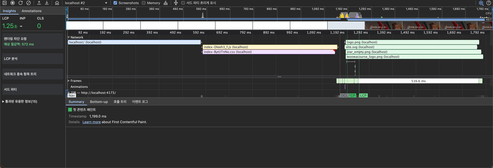
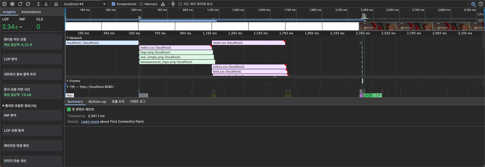
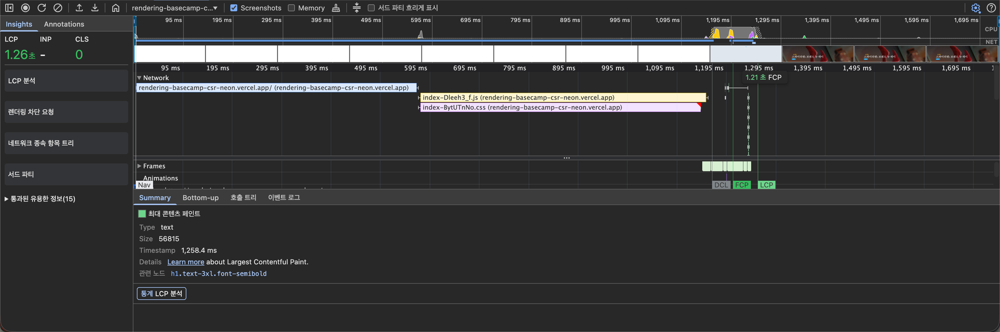
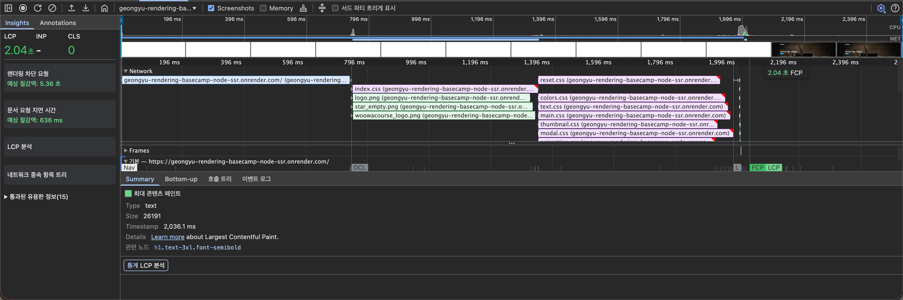

# 성능 시나리오

> `/` 홈 화면 Slow 4G 기준 FCP 를 측정하고, CSR(`react-csr`) 과 Classic SSR(`node-ssr`) 의 전후 결과를 비교한다.

## 0. 측정 케이스

| Case | 환경 | 네트워크 | CPU | 상태 |
| --- | --- | --- | --- | --- |
| [A](#case-a--로컬-production--slow-4g) | 로컬 production 빌드 | Slow 4G | 스로틀 없음 | ✅ 완료 |
| [B](#case-b--배포-환경--slow-4g) | 배포 환경 (CSR: Vercel, SSR: Render) | Slow 4G | 스로틀 없음 | ✅ 완료 |

### 공통 측정 방법

| 항목 | 값 |
| --- | --- |
| 페이지 | `/` (홈) |
| 도구 | Chrome DevTools > Performance 패널 (Screenshots 활성화) |
| 조건 | 시크릿 창, Network > Disable cache 활성화 |
| 횟수 | 조합(Case × CSR/SSR)마다 **5회** 측정, 표의 값은 **중앙값** |
| 스크린샷 | 5회 중 중앙값 회차를 대표로 캡처 (캡션에 해당 회차 값 표기) |
| CSR 실행 (로컬) | `../react-csr` 에서 `npm run build && npm run preview` → `http://localhost:4173/` |
| SSR 실행 (로컬) | `node-ssr` 에서 `npm run start` → `http://localhost:8080/` |
| CSR 배포 URL | https://rendering-basecamp-csr-neon.vercel.app/ |
| SSR 배포 URL | https://geongyu-rendering-basecamp-node-ssr.onrender.com/ |

### 구현 내용 (node-ssr)

`express` 서버가 요청마다 TMDB `popular` API 를 호출하고, 템플릿 리터럴로 데이터가 채워진 HTML 을 만들어 응답한다.
클라이언트로 내려보내는 JS 는 없다. 스타일은 `/styles/index.css` 한 개를 `<link>` 로 연결하고, 그 파일이 나머지 CSS 8개를 `@import` 한다.

### 측정 원본 (5회)

| 조합 | FCP | LCP |
| --- | --- | --- |
| A-CSR | 1,211.1, 1,199.0, 1,212.7, 1,192.2, 1,192.2 ms | 1.26, 1.25, 1.27, 1.25, 1.24 s |
| A-SSR | 2,371.5, 2,340.3, 2,337.0, 2,341.1, 2,372.6 ms | 2.37, 2.34, 2.34, 2.34, 2.37 s |
| B-CSR | 1.54, 1.22, 1.20, 1.21, 1.21 s | 1,593.6, 1,261.4, 1,238.9, 1,252.1, 1,258.4 ms |
| B-SSR | LCP 와 동일 | 2,468.5, 2,056.5, 2,004.5, 2,036.1, 2,010.0 ms |

- LCP 요소는 CSR/SSR 모두 `h1.text-3xl.font-semibold` (히어로 영화 제목, Type: text) 이다.
- SSR 은 모든 회차에서 FCP 와 LCP 가 같은 시점에 찍혔다.
- CSR 도 FCP 와 LCP 차이가 약 40 ~ 50 ms 에 그쳤다. 1단계(Fast 4G)에서는 API 응답을 기다리느라 0.75 s 차이가 났다. <!-- TODO: Slow 4G 인데 API 왕복이 50 ms 안에 끝난 이유 확인 (Network 패널에서 api.themoviedb.org 요청 시간 보기) -->
- B-CSR 1회차(FCP 1.54 s)와 B-SSR 1회차(2,468.5 ms)는 다른 회차보다 0.3 ~ 0.4 s 늦었다. 첫 접속이라 서버 쪽 웜업이 포함된 것으로 보이며, 중앙값에는 영향이 없어 제외하지 않았다.

---

## Case A — 로컬 production / Slow 4G

### A-1. 기준치 (Baseline) — `react-csr`



> 캡처: 2회차 (FCP 1,199.0 ms, LCP 1.25 s)

| 지표 | 값 (중앙값) |
| --- | --- |
| **FCP** | **1,199.0 ms** |
| LCP | 1.25 s |

#### 타임라인 분석 (캡처 회차 기준)

```
0 ms ─────────── ~0.8 s ──────────────────── ~1.19 s ──── 1,199 ms ─── 1.25 s
│ HTML(빈 #root) │ JS 번들 + CSS 번들 병렬 다운로드 │ DCL        │ FCP        │ LCP
```

1. **HTML 수신**: 빈 `<div id="root">` 만 있는 HTML 을 받는다. Slow 4G 의 왕복 지연 때문에 이 요청만으로 약 0.6 ~ 0.8 s 가 걸린다.
2. **JS + CSS 병렬 다운로드**: Vite 가 묶어 준 `index-*.js` 와 `index-*.css` 파일 2개를 동시에 받는다. 두 파일 모두 약 1.19 s 에 끝난다.
3. **FCP (1,199.0 ms)**: DCL 직후 React 가 마운트되며 첫 페인트가 찍힌다.
4. **LCP (1.25 s)**: FCP 약 50 ms 뒤에 찍힌다. 이미지(`logo.png`, `star_empty.png` 등)는 그 뒤에 받는다.

#### 병목 요약

문서 요청 1회 + 번들 다운로드 1회, 총 2단계의 네트워크 왕복이 FCP 앞에 있다.
JS 와 CSS 를 각각 파일 1개로 묶어 동시에 받기 때문에, 왕복 횟수가 더 늘지 않는다.

### A-2. 개선 — `node-ssr` (Classic SSR)



> 캡처: 4회차 (FCP 2,341.1 ms, LCP 2.34 s)

| 지표 | 값 (중앙값) |
| --- | --- |
| **FCP** | **2,341.1 ms** |
| LCP | 2.34 s (FCP 와 동일) |

#### 타임라인 분석 (캡처 회차 기준)

```
0 ms ─────────── ~0.58 s ──── ~0.87 s ────────── ~1.17 s ──────────── 2,341 ms
│ HTML(데이터 포함) │ index.css │ reset/colors/text/main.css │ 나머지 @import CSS │ FCP = LCP
```

1. **HTML 수신 (~0.58 s)**: 서버가 TMDB 응답을 받아 데이터가 채워진 HTML 을 내려준다. DCL 이 약 0.58 s 에 찍힌다. CSR 의 문서 요청(0.6 ~ 0.8 s)보다 늦지 않았다.
2. **index.css 다운로드 (0.58 → 0.87 s)**: `<link>` 로 연결된 `index.css` 를 받는다. 이 파일 자체는 191 바이트지만, 안에 `@import` 8개가 들어 있다.
3. **@import 된 CSS 다운로드 (0.87 s → …)**: 브라우저는 `index.css` 를 다 받고 나서야 `reset.css`, `colors.css`, `text.css`, `main.css` … 요청을 시작한다. 이 요청들이 Slow 4G 에서 다시 왕복 비용을 치른다.
4. **FCP = LCP (2,341.1 ms)**: 렌더링을 막는 CSS 가 모두 도착한 뒤에야 첫 페인트가 일어난다. 데이터는 HTML 에 이미 있으므로 첫 페인트에 h1 도 함께 그려져 FCP 와 LCP 가 같다.

Insights 의 "렌더링 차단 요청" 항목이 예상 절감액 **5.21 초** 를 보고한다. CSR 쪽은 같은 항목이 **576 ms** 다.

#### 병목 요약

문서 요청 1회 + `index.css` 1회 + `@import` 된 CSS 1회, 총 3단계의 네트워크 왕복이 FCP 앞에 직렬로 놓여 있다.
CSR 보다 왕복이 한 단계 많고, Slow 4G 는 왕복 한 번이 수백 ms 라서 그 차이가 그대로 FCP 에 더해졌다.

### A-3. 결과 비교

| 지표 | CSR (`react-csr`) | Classic SSR (`node-ssr`) | 변화 |
| --- | --- | --- | --- |
| **FCP** | 1,199.0 ms | **2,341.1 ms** | **약 +1.14 s (약 95% 악화)** |
| LCP | 1.25 s | 2.34 s (FCP 와 동일) | 약 +1.09 s |
| 문서 응답 (DCL) | 약 0.6 ~ 0.8 s | 약 0.58 s | 비슷함 |
| 렌더링 차단 요청 (Insights) | 576 ms | 5.21 s | — |
| FCP 경로 | HTML → JS/CSS 번들 → 실행 → 페인트 | HTML(데이터 포함) → index.css → @import CSS → 페인트 | 왕복 1단계 추가 |

#### 결론

- 예상과 반대로 Classic SSR 의 FCP 가 CSR 보다 약 1.14 s 늦었다.
- 원인은 SSR 자체가 아니라 CSS 로딩 구조다. `index.css` 의 `@import` 체인이 Slow 4G 에서 네트워크 왕복을 한 단계 더 만들었다.
- 서버가 TMDB 를 기다리는 비용은 이번 측정에서 드러나지 않았다. SSR 의 문서 응답이 CSR 과 비슷하거나 빨랐다.
- JS 가 없다는 장점은 CSS 왕복 비용에 가려졌다. CSR 의 JS 번들은 CSS 와 병렬로 받기 때문에 Slow 4G 에서도 왕복 횟수를 늘리지 않았다.

<!-- TODO: @import 체인을 제거(CSS 1개로 합치기 또는 <link> 8개로 펼치기)한 뒤 재측정할지 결정. 재측정하면 A-2' 절을 추가하고 개선 전/후를 비교한다. -->

---

## Case B — 배포 환경 / Slow 4G

> CSR 은 Vercel, node-ssr 은 Render 에 배포한 뒤 Case A 와 같은 조건(Slow 4G, CPU 스로틀 없음)으로 측정했다.

### B-1. 기준치 (Baseline) — `react-csr`



> 캡처: 5회차 (FCP 1.21 s, LCP 1,258.4 ms)

| 지표 | 값 (중앙값) |
| --- | --- |
| **FCP** | **1.21 s** |
| LCP | 1,258.4 ms |
| LCP 요소 | `h1.text-3xl.font-semibold` |

#### 타임라인 분석 (캡처 회차 기준)

```
0 ms ─────────── ~0.83 s ──────────────────── ~1.19 s ──── 1.21 s ─── 1,258 ms
│ HTML(빈 #root) │ JS 번들 + CSS 번들 병렬 다운로드 │ DCL        │ FCP      │ LCP(h1)
```

1. **HTML 수신 (~0.83 s)**: 빈 HTML 인데도 Slow 4G 왕복 때문에 약 0.8 s 가 걸린다.
2. **JS + CSS 병렬 다운로드 (0.83 → 1.19 s)**: 파일 2개를 동시에 받는다.
3. **FCP (1.21 s) → LCP (1,258.4 ms)**: DCL 직후 첫 페인트, 약 40 ms 뒤 h1 이 LCP 로 찍힌다.

로컬(Case A)과 거의 같은 수치다. Slow 4G 에서는 네트워크 왕복 지연이 서버 위치 차이를 덮는다.

### B-2. 개선 — `node-ssr` (Classic SSR)



> 캡처: 4회차 (FCP = LCP 2,036.1 ms)

| 지표 | 값 (중앙값) |
| --- | --- |
| **FCP** | **2,036.1 ms** |
| LCP | 2,036.1 ms (FCP 와 동일) |
| LCP 요소 | `h1.text-3xl.font-semibold` |

#### 타임라인 분석 (캡처 회차 기준)

```
0 ms ─────────── ~0.78 s ──── ~1.19 s ──────────── ~1.63 s ──── 2,036 ms
│ HTML(데이터 포함) │ index.css │ @import CSS 8개 병렬 │ 페인트 준비 │ FCP = LCP
```

1. **HTML 수신 (~0.78 s)**: Render 서버가 TMDB 응답을 받아 HTML 을 내려준다. Insights 가 "문서 요청 지연 시간" 을 5회 모두 보고했다 (예상 절감액 611 ms ~ 1.07 s). 로컬(Case A)에서는 없던 항목이다.
2. **index.css 다운로드 (0.78 → 1.19 s)**: `<link>` 로 연결된 파일 1개를 먼저 받는다.
3. **@import CSS 다운로드 (1.19 → 1.63 s)**: `index.css` 를 다 받은 뒤에야 `reset.css` 부터 `media.css` 까지 8개 요청이 시작된다. 배포 환경은 HTTP/2 라서 8개가 동시에 내려오지만, `index.css` 뒤에 놓인 왕복 한 단계는 그대로다.
4. **FCP = LCP (2,036.1 ms)**: CSS 가 모두 도착한 뒤 h1 을 포함한 첫 화면이 그려진다.

Insights 의 "렌더링 차단 요청" 예상 절감액은 5.31 ~ 5.37 s 로 로컬과 같은 수준이다.

#### 병목 요약

로컬(Case A)과 같은 3단계 직렬 왕복(HTML → index.css → @import CSS)에, 배포 서버의 문서 응답 지연이 더해졌다.
그런데도 FCP 는 로컬보다 약 0.3 s 빨랐다. 로컬(`http://localhost`)은 HTTP/1.1 이라 `@import` 8개가 연결 수 제한에 걸려 두 차례로 나뉘어 내려왔고, 배포 환경(HTTPS)은 HTTP/2 로 한 번에 내려온 것으로 보인다. <!-- TODO: Network 패널 Protocol 열에서 h2 여부 확인 -->

### B-3. 결과 비교

| 지표 | CSR (`react-csr`) | Classic SSR (`node-ssr`) | 변화 |
| --- | --- | --- | --- |
| **FCP** | 1.21 s | **2,036.1 ms** | **약 +0.83 s (약 68% 악화)** |
| LCP | 1,258.4 ms | 2,036.1 ms (FCP 와 동일) | 약 +0.78 s |
| LCP 요소 | `h1.text-3xl.font-semibold` | `h1.text-3xl.font-semibold` | 동일 |
| 문서 응답 (DCL) | 약 0.8 s | 약 0.78 s | 비슷함 |
| 렌더링 차단 요청 (Insights) | 없음 | 5.36 s | — |
| FCP 경로 | HTML → JS/CSS 번들 → 실행 → 페인트 | HTML(데이터 포함) → index.css → @import CSS → 페인트 | 왕복 1단계 추가 |

#### 결론

- 배포 환경에서도 Classic SSR 의 FCP 가 CSR 보다 약 0.83 s 늦었다. 원인은 Case A 와 같은 `@import` 체인이다.
- 격차는 로컬(+1.14 s)보다 줄었다. `@import` 8개가 병렬로 내려와 체인의 마지막 단계가 짧아졌기 때문으로 보인다.
- 서버의 TMDB 대기(문서 요청 지연 0.6 ~ 1.1 s)가 배포 환경에서는 Insights 에 잡혔다. 다만 CSR 의 빈 HTML 응답도 Slow 4G 왕복 때문에 비슷하게 느려서, DCL 시점은 둘이 거의 같았다.

## 종합

| Case | 환경 | CSR FCP | Classic SSR FCP | 변화 |
| --- | --- | --- | --- | --- |
| A | 로컬 / Slow 4G | 1,199.0 ms | 2,341.1 ms | 약 +95% |
| B | 배포 / Slow 4G | 1.21 s | 2,036.1 ms | 약 +68% |

> 모든 값은 5회 측정의 중앙값이다.

- 로컬과 배포 환경 모두에서 Classic SSR 의 FCP 가 CSR 보다 늦었다 (로컬 약 2배, 배포 약 1.7배).
- 원인은 `index.css` 의 `@import` 체인이다. 느린 네트워크에서는 요청 왕복 횟수가 FCP 를 결정하는데, `@import` 가 왕복을 한 단계 더 만들었다.
- 클라이언트 JS 가 없다는 Classic SSR 의 장점은, CSS 를 한 번에 받도록 고쳐야 FCP 에 드러난다.
- 배포 환경이 로컬보다 격차가 작았던 이유는 `@import` 8개가 병렬로 내려왔기 때문으로 보인다. 체인 자체는 그대로라 격차가 사라지지는 않았다.
- 1단계(Fast 4G)에서는 SSR 의 FCP 가 +0.15 ~ 0.45 s 늦었고 원인은 서버의 API 대기였다. 이번(Slow 4G)에는 +0.83 ~ 1.14 s 늦었고 원인은 CSS 왕복이었다. 느린 네트워크일수록 서버 처리 시간보다 요청 횟수가 더 크게 작용했다.
